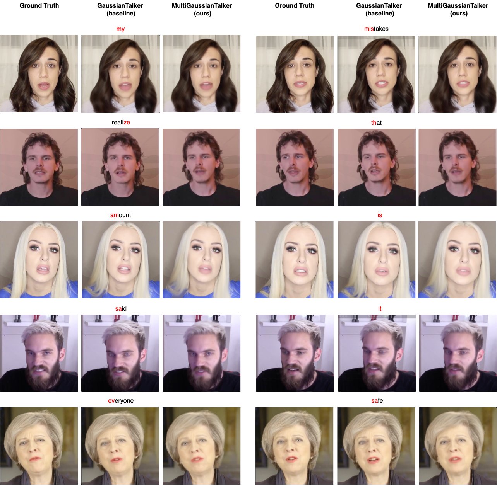

# MultiGaussianTalker: Generalizing Gaussian Splatting for Multi-Identity Lip Synced Video Synthesis

Project in CS670: Computer Vision

## Introduction
We present MultiGaussianTalker, a novel framework for multi-identity lip-synced video synthesis using 3D Gaussian Splatting. Unlike existing methods that require separate model for each identity, MultiGaussianTalker learns a unified network capable of synthesizing lip-synced videos for multiple speakers. Our approach introduces a two-stage training process leveraging a multiplicative module to disentangle identity and audio specific information. The proposed framework allows for efficient multi-identity video synthesis, significantly reducing training time and computational overhead. Our method achieves over **6.8x faster training** compared to contemporary models which are trained individually on different speakers, all the while maintaining lip sync accuracy and visual quality.



## Installation
We have implemented & tested **MultiGaussianTalker** with an NVIDIA A30 GPU.

Run the below codes for the environment setting. ( details are in requirements.txt )
```bash
git clone https://github.com/joungbinlee/GaussianTalker.git
cd GaussianTalker
git submodule update --init --recursive
conda create -n mgtalker python=3.7 
conda activate mgtalker

pip install -r requirements.txt
pip install -e submodules/custom-bg-depth-diff-gaussian-rasterization
pip install -e submodules/simple-knn
pip install "git+https://github.com/facebookresearch/pytorch3d.git"
pip install tensorflow-gpu==2.8.0
pip install --upgrade "protobuf<=3.20.1"
```


## Download Dataset

We used 1 minute talking portrait videos from the [HDTF dataset](https://github.com/MRzzm/HDTF).

You can see an example video with the below line:

```
wget https://github.com/YudongGuo/AD-NeRF/blob/master/dataset/vids/Obama.mp4?raw=true -O data/obama/obama.mp4
```

## Data Preparation

- prepare face-parsing model.

```bash
wget https://github.com/YudongGuo/AD-NeRF/blob/master/data_util/face_parsing/79999_iter.pth?raw=true -O data_utils/face_parsing/79999_iter.pth
```

- Download 3DMM model from [Basel Face Model 2009](https://faces.dmi.unibas.ch/bfm/main.php?nav=1-1-0&id=details) 

Put "01_MorphableModel.mat" to data_utils/face_tracking/3DMM/ 
    
```bash
cd data_utils/face_tracking
python convert_BFM.py
cd ../../
python data_utils/process.py ${YOUR_DATASET_DIR}/${DATASET_NAME}/${DATASET_NAME}.mp4 
```

- Obtain AU45 for eyes blinking
  
Run `FeatureExtraction` in [OpenFace](https://github.com/TadasBaltrusaitis/OpenFace), rename and move the output CSV file to `(your dataset dir)/(dataset name)/au.csv`.

Below is directory structure for a single person. Please make sure to have all persons data in a similar format.

```
├── (your dataset dir)
│     ├──person1
│            ├── gt_imgs
│                ├── 0.jpg
│                ├── 1.jpg
│                ├── 2.jpg
│                ├── ...
│            ├── ori_imgs
│                ├── 0.jpg
│                ├── 0.lms
│                ├── 1.jgp
│                ├── 1.lms
│                ├── ...
│            ├── parsing
│                ├── 0.png
│                ├── 1.png
│                ├── 2.png
│                ├── 3.png
│                ├── ...
│            ├── torso_imgs
│                ├── 0.png
│                ├── 1.png
│                ├── 2.png
│                ├── 3.png
│                ├── ...
│            ├── au.csv
│            ├── aud_ds.npy
│            ├── aud_novel.wav
│            ├── aud_train.wav
│            ├── aud.wav
│            ├── bc.jpg
│            ├── (dataset name).mp4
│            ├── track_params.pt
│            ├── transforms_train.json
│            ├── transforms_val.json
|     ├──person2
|           ├──...
|           ├──...
|     ├──person3
|           ├──...
|           ├──...
```

## Training

```bash
python train.py -s ${YOUR_DATASET_DIR}/${DATASET_NAME} --model_path ${YOUR_MODEL_DIR} --configs arguments/64_dim_1_transformer.py --persons "person1 person2 person3 ..."
```
Please modify the argument `persons` according to your dataset of selected identities.

## Rendering

Please adjust the batch size to match your GPU settings.

```bash
python render.py -s ${YOUR_DATASET_DIR}/${DATASET_NAME} --model_path ${YOUR_MODEL_DIR} --configs arguments/64_dim_1_transformer.py --iteration 50000 --batch 128 --skip_train --persons "person1 person2 person3 ..."
```
    
## Inference with custom audio
Please prepare <custom_aud>.wav and <custom_aud>.npy as detailed in the data processing steps.

```bash
python render.py -s ${YOUR_DATASET_DIR}/${DATASET_NAME} --model_path ${YOUR_MODEL_DIR} --configs arguments/64_dim_1_transformer.py --iteration 10000 --batch 128 --custom_aud <path_to_custom_aud>.npy --custom_wav <path_to_custom_aud>.wav --skip_train --skip_test
```

## Acknowledgement
Our project builds upon the work [GaussianTalker](https://github.com/cvlab-kaist/GaussianTalker).